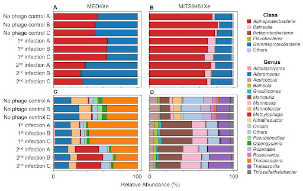
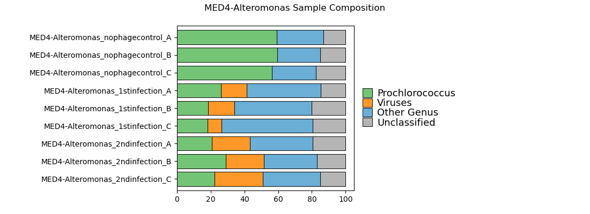
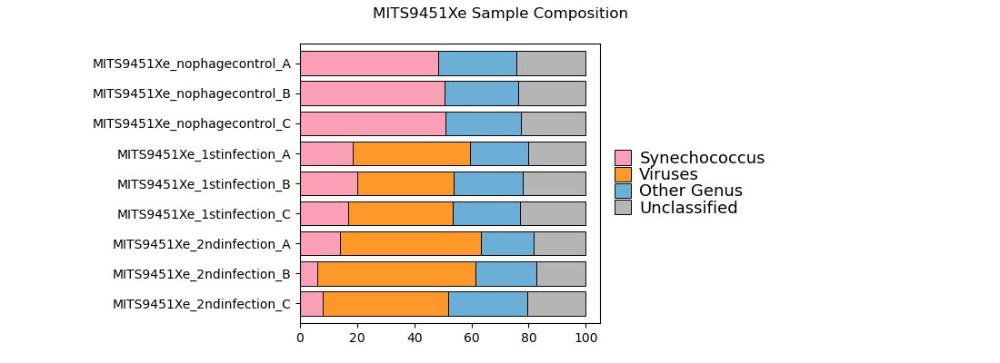
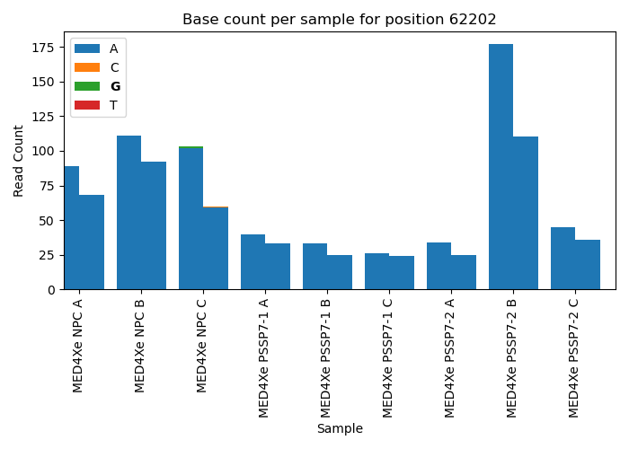
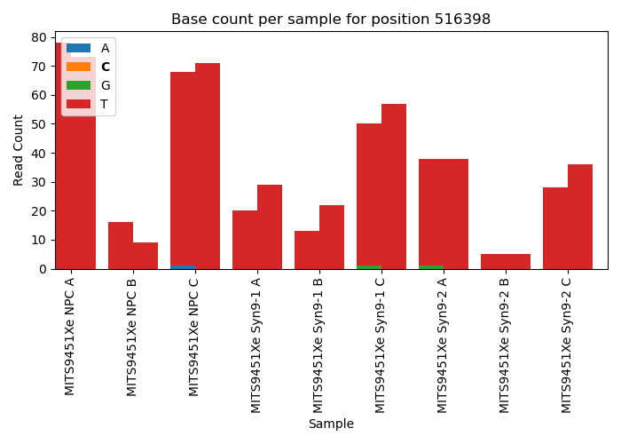
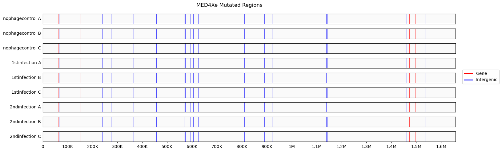

## *Picocyanobacteria*: influence of Heterotrophic Communities on Cyanophage Infection Dynamics
Repository for modified pipelines, scripts, and figures for DNA sequencing analyses in the publication: 
1. Coe, A., Parker, S.M., Vo, N.N., Kearney, S., Pollack, S., Emster, K., Mullet, J., Castro, K.G., Chisholm, S.W. (2025). The Influence of Heterotrophic Communities on Cyanophage Infection Dynamics in Prochlorococcus and Synechococcus Cultures. (In preparation). 

## Microbial Abundance Analysis
All codes for microbial abundance analysis are located in `taxonomic-classification`.
- Raw reads are processed through a modified version of [ProSynTax-workflow](https://github.com/jamesm224/ProSynTax-workflow/tree/main) to obtain classification.  
- Scripts in `taxonomic-classification/analysis/` were used to generate data and figures.   

**Figure 10:**  
  

**Overview Sample Composition:**  

  
  

  

### Modified ProSynTax Workflow  
The [ProSynTax-workflow](https://github.com/jamesm224/ProSynTax-workflow/tree/main) was modified to include removal of Thermus internal standards, and to generate additional data using Kaiju.   

Snakemake rules added:  
- `SRA_download`: downloads SRA file from NCBI.  
- `run_trim_PE_local` and `run_trim_PE_sra`: edited `run_trim_PE` to process both local files and files downloaded from NCBI SRA.  
- `index_genome`: index reference Thermus genome.  
- `obtain_thermus_reads`: map reads to Thermus genome and obtain names of reads mapped.  
- `remove_thermus_reads`: remove Thermus reads from FASTQ file.  
- `kaiju_summary_*`: additional `kaiju2table` rules to produce summary output for different taxonomic ranks. 

#### Abundance Analysis   
Subfolders within the `analysis/` directory contains:  
- `SampleOverview/`: scripts to parse and plot relative and absolute composition of ['Prochlorococcus', 'Synechococcus', 'Viruses', 'Other Genus', 'Unclassified'] within each sample.  
- `HetComposition/`: scripts to parse and plot relative composition of Heterotroph community within each sample for various taxonomic ranks.  
- `SuppTable/`: script to make Supplemental Table.  

## Variant Calling Analysis  
All codes for variant calling analysis are located in `variant-calling`.  
- Raw reads are processed through a modified version of [WideVariant](https://github.com/liebermanlab/WideVariant) workflow developed by the Lieberman lab to obtain variants.  
- Scripts in `variant-calling/analysis/` folder were used to generate data and figures for publication.   

**Variant position across samples:**  

   
   

  

**Variant positions across genome:**  

    

  

### Modified WideVariant Workflow  
The [WideVariant](https://github.com/liebermanlab/WideVariant) workflow was modified to decrease filtering thresholds: 
- minimum allele frequency threshold decreased to 0.1
- maximum read depth per position increased to 5000

Conda environments in `envs/*.yaml` files were adjusted to enable compatibility with our system. 

### Variant Analysis  
Subfolders within the `analysis/` directory contains:   
- `snv-position/`: scripts to extract and plot variant positions across samples from WideVariant workflow.  
- `genome-plots/`: scripts to extract structural variant calls from WideVariant and additional filtering. 

